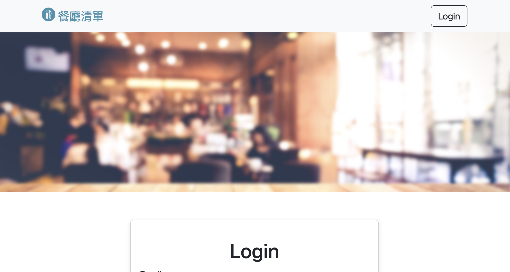

# 短網址產生器


## 介紹
學期3(後端), week 1, A1:餐廳清單Final

### 功能
* 使用者可以註冊自己的帳號
* 使用者可以透過Facebook登入
* 使用者可以新增一家餐廳
* 使用者可以瀏覽自己加入的餐廳詳細資訊
* 使用者可以瀏覽全部所有餐廳
* 使用者可以修改一家餐廳的資訊
* 使用者可以刪除一家餐廳


## 開始使用
* 確認安裝npm, Node.js
* 將專案clone到本地
* 本地開啟後，透過終端機進入資料夾，輸入：```npm install```
* 安裝完畢後，輸入：```npm start```
* 成功的話會在終端機看到：```Express is running on http://localhost:3000```
```mongodb connected!```
* 打開瀏覽器進入：```http://localhost:3000```
* 欲暫停，輸入：```control + c```

## 開發工具
* Node.js 18.12.1
* Express 4.16.4
* Express-Handlebars 3.0.0
* Bootstrap 5.2.3
* mongoose 5.9.7
* dotenv 16.0.3
* bcryptjs 2.4.3
* body-parser 1.20.1
* connect-flash 0.1.1
* express-session 1.17.1
* method-override 3.0.0
* passport 0.4.1
* passport-facebook 3.0.0
* passport-local 1.0.0